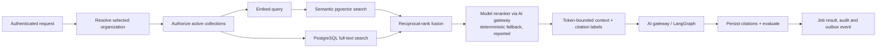

# Agentic RAG design (Phase 10)

This is the implementation contract for JT-Code's agentic RAG path. It uses
Supabase PostgreSQL with pgvector, not Pinecone: [ADR-003](adr/ADR-003-agentic-rag-vector-store.md)
is the repository's approved, superseding decision. Django is the authorization
and policy boundary; no client, worker, model, or vector metadata is trusted as
an authority on its own.

## Design goals

- Return only evidence from collections the selected organization can access.
- Make ingestion deterministic, retryable, observable, and safe to re-run.
- Keep evidence provenance through retrieval, prompt construction, output, and
  durable citation records.
- Bound external I/O, extracted bytes, candidates, context tokens, model calls,
  and evaluation work.
- Measure regression quality rather than relying on a model's confidence.

## Request and agent flow



1. The API authenticates with Supabase JWT verification and resolves exactly
   one selected organization. A client-supplied collection id is only a
   narrowing filter; it never selects a tenant.
2. The API filters `Collection` rows by that organization and active status
   before embedding or retrieval. `hybrid_search` repeats the organization
   predicate inside both lexical and vector retrieval. Both paths also apply
   `Document.visibility`: organization-visible documents are available to
   members, while restricted documents require an explicit
   `DocumentAccessGrant` (the source creator and organization administrators
   retain operational access). Inactive collections/sources and non-indexed
   documents are excluded at every retrieval and citation boundary.
3. The query embedding is generated by the configured server-side provider
   using its retrieval-query mode. Document embeddings use retrieval-document
   mode (Gemini `batchEmbedContents` over REST, or OpenAI). If the embedding
   provider is temporarily unavailable, authorized lexical retrieval remains
   available and the response reports `degraded: ["semantic"]`. The
   provider/model/dimension representation is recorded as
   `Chunk.embedding_version` (for example `gemini/gemini-embedding-001@1536`),
   and semantic search compares the query only with vectors of the current
   version, so a model change never mixes embedding spaces.
4. Semantic pgvector candidates (HNSW cosine) and lexical candidates (a
   generated `tsvector` column with a GIN index, `ts_rank_cd`) are
   independently limited. Reciprocal-rank fusion combines their ranks. With
   `RAG_RERANKER=model` the `RAG_RERANK_MODEL_ALIAS` gateway model scores every
   fused passage (passages are passed as untrusted data); if it fails, the
   deterministic coverage reranker is used and `degraded` includes `reranker`.
   The document ACL is an `EXISTS` subquery, so no `DISTINCT` defeats the
   indexes.
5. The context builder removes duplicate chunks, keeps complete chunks only,
   applies `RAG_MAX_CONTEXT_TOKENS`, and emits stable `[n]` labels with document,
   chunk, page, and heading provenance.
6. The grounded system prompt allows claims only from that context and requires
   `[n]` citations. An empty evidence set requires explicit abstention.
7. The worker re-checks every cited chunk belongs to the job's organization,
   creates `Citation` rows, and writes a `RAGEvaluation`. The result exposes
   sources, context token count, retrieval metadata, grounded state, and the
   evaluation summary. A retrieval error fails the job; it is never turned
   into an abstention.
8. Agent runs that call `knowledge.search` persist each shown result as a
   `Citation` on the run (numbered across calls and approval pauses); the
   run's evaluation passes `groundedWhenRetrieving` only if every `[n]` in the
   final answer resolves to recorded evidence.

## Ingestion flow

1. An editor/admin creates a tenant-owned collection and source. The API only
   exposes fully implemented source types: inline text, HTTPS URL, and a
   registered ready Supabase Storage asset. Source configuration and ACL structure are
   validated before persistence.
2. Sync materializes a source into one idempotent `Document` using its external
   id and queues `process_document` on the ingestion worker.
3. Extraction accepts text, HTTPS URL, or a registered ready asset. URL and
   asset retrieval use the SSRF-safe egress layer: public HTTPS DNS targets,
   DNS pinning, redirect re-validation, timeouts, and byte caps. MIME types and
   text/PDF parsers are allowlisted.
   Supported content: plain text, Markdown, CSV, JSON, HTML (structure-aware
   parser that drops scripts/styles), PDF (per-page offsets) and DOCX
   (headings preserved). Asset bytes are verified against the stored SHA-256.
4. The normalized text is SHA-256 hashed. The deterministic chunker produces
   word-aligned chunks that overlap by up to `chunk_overlap` characters, with
   a level-aware Markdown heading path and the page number for PDFs.
5. A document is claimed under a row lock before indexing, so concurrent
   re-index requests cannot interleave. Embeddings are generated before
   replacement, then old chunks are deleted and the new chunks (with vectors)
   are inserted in one transaction, so readers never see a half-indexed
   document. Transient embedding failures are retried with backoff up to
   `RAG_INGESTION_MAX_RETRIES`; permanent failures fail the document. The
   `recover_stalled_ingestion` beat task requeues sources/documents abandoned
   by crashed workers after `RAG_INGESTION_STALLED_MINUTES`.
6. Every synchronization has a durable `SyncRun` with document/chunk counts.
   Blank schedules are manual-only; five-field cron expressions (plus
   `@hourly`, `@daily`, `@weekly`, and `@monthly`) are evaluated by the beat
   sweep, so indexed manual sources are not continuously reprocessed.
7. Completion refreshes source/collection aggregates and emits
   `knowledge.document.indexed`; failure records a bounded error and emits
   `knowledge.document.index_failed`.

## Evaluation and release gate

`RAGEvaluation` records precision, recall and MRR when expected chunk ids are
provided, citation-number validity, abstention, and groundedness. With
`RAG_JUDGE=model` the `RAG_JUDGE_MODEL_ALIAS` gateway model also judges whether
the cited evidence supports the answer's claims; an answer with valid `[n]`
markers but unsupported claims is not grounded. If the judge is unavailable the
structural evaluation is still recorded (`evaluator` says which ran).

The versioned regression corpus is `tests/fixtures/rag_regression_cases.json`
(12 cases with distractors and a multi-document case). The test suite ingests
it through the real pipeline on Supabase (pgvector + full-text) and enforces
`RAG_EVAL_MIN_RECALL` and `RAG_EVAL_MIN_MRR`. Against real providers run:

```bash
python manage.py rag_evaluate --organization <org-uuid> --user <member-uuid>
```

It ingests the dataset into a temporary collection with the configured
embedding provider and reranker, prints recall@k/MRR per case, deletes the
collection, and exits non-zero below the thresholds. Release also requires the
restricted-document and cross-tenant tests to return no foreign content.

## API (`/api/v1/knowledge/`)

| Method & path | Purpose |
| --- | --- |
| `GET, POST collections/` | List (unpaginated, with visible sources) / create |
| `GET, PATCH, DELETE collections/{id}/` | Read, rename/tune chunking, delete |
| `POST collections/{id}/sync/` | Queue sync for visible active sources |
| `GET, POST collections/{id}/sources/` | List / add a source (returns the collection) |
| `DELETE collections/{id}/sources/{sourceId}/` | Remove a source (returns the collection) |
| `GET, POST sources/`, `GET, PATCH, DELETE sources/{id}/` | Source CRUD (creator/admin writes) |
| `POST sources/{id}/sync/`, `GET sources/{id}/sync-runs/` | Sync now; sync history |
| `GET documents/`, `GET, DELETE documents/{id}/` | ACL-filtered documents; soft delete |
| `GET documents/{id}/chunks/`, `POST documents/{id}/reindex/` | Chunks; re-index |
| `GET, POST documents/{id}/grants/`, `DELETE documents/{id}/grants/{userId}/` | Restricted-document grants |
| `POST documents/{id}/download/` | Signed link to a FILE document's original |
| `GET chunks/`, `GET sync-runs/`, `GET citations/?jobId=&agentRunId=` | Read models |
| `GET search/?query=&collectionId=&topK=` | Hybrid search → `KnowledgeSearchResult[]` |
| `POST search/` | Hybrid search with `collectionIds`, `topK`, `minSimilarity` |
| `POST query/` | Synchronous grounded answer (`answer`, `sources`, `evaluation`) |
| `POST rag/query/` | Asynchronous grounded answer (returns `jobId`) |
| `POST rag/evaluate/`, `GET rag-evaluations/` | Evaluate an answer; evaluation history |

`POST /api/v1/embeddings/` returns vectors in the same embedding space
(`embeddingVersion`) as stored chunks.

## Operations

Tune candidates, context budget and thresholds through the documented `RAG_*`
environment values. Changing `VECTOR_EMBEDDING_DIMENSIONS` requires a
compatible pgvector migration; changing the embedding model requires a full
re-index (stale-version vectors are excluded from search until re-indexed).
Use a dedicated Supabase test database for the integration gate; never point
`TEST_DATABASE_URL` at a development or production database.
