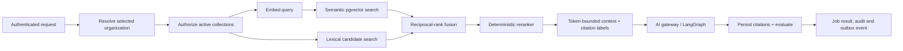

# Agentic RAG design (Phase 10)

This is the implementation contract for JT-Code's agentic RAG path. It uses
Supabase PostgreSQL with pgvector, not Pinecone: [ADR-003](adr/ADR-003-agentic-rag-vector-store.md)
is the repository's approved, superseding decision. Django is the authorization
and policy boundary; no client, worker, model, or vector metadata is trusted as
an authority on its own.

## Design goals

- Return only evidence from collections the selected organization can access.
- Make ingestion deterministic, retryable, observable, and safe to re-run.
- Keep evidence provenance through retrieval, prompt construction, output, and
  durable citation records.
- Bound external I/O, extracted bytes, candidates, context tokens, model calls,
  and evaluation work.
- Measure regression quality rather than relying on a model's confidence.

## Request and agent flow

1. The API authenticates with Supabase JWT verification and resolves exactly
   one selected organization. A client-supplied collection id is only a
   narrowing filter; it never selects a tenant.
2. The API filters `Collection` rows by that organization and active status
   before embedding or retrieval. `hybrid_search` repeats the organization
   predicate inside both lexical and vector retrieval. Both paths also apply
   `Document.visibility`: organization-visible documents are available to
   members, while restricted documents require an explicit
   `DocumentAccessGrant` (the source creator and organization administrators
   retain operational access). Inactive collections/sources and non-indexed
   documents are excluded at every retrieval and citation boundary.
3. The query embedding is generated by the configured server-side provider
   using its retrieval-query mode. Document embeddings use retrieval-document
   mode. If an embedding provider is temporarily unavailable, authorized
   lexical retrieval remains available rather than failing the whole query.
   The provider/model/dimension representation is recorded as
   `Chunk.embedding_version` (for example `openai/text-embedding-3-small@1536`).
4. Semantic pgvector candidates and lexical candidates are independently
   limited. Reciprocal-rank fusion combines their ranks; the deterministic
   hybrid reranker then scores query-term coverage plus both retrieval signals.
5. The context builder removes duplicate chunks, keeps complete chunks only,
   applies `RAG_MAX_CONTEXT_TOKENS`, and emits stable `[n]` labels with document,
   chunk, heading, and offset provenance.
6. The grounded system prompt allows claims only from that context and requires
   `[n]` citations. An empty evidence set requires explicit abstention.
7. The worker re-checks every cited chunk belongs to the job's organization,
   creates `Citation` rows, and writes a `RAGEvaluation`. The result exposes
   sources, context token count, grounded state, and evaluation summary.

## Ingestion flow

1. An editor/admin creates a tenant-owned collection and source. The API only
   exposes fully implemented source types: inline text, HTTPS URL, and a
   registered ready ImageKit asset. Source configuration and ACL structure are
   validated before persistence.
2. Sync materializes a source into one idempotent `Document` using its external
   id and queues `process_document` on the ingestion worker.
3. Extraction accepts text, HTTPS URL, or a registered ready asset. URL and
   asset retrieval use the SSRF-safe egress layer: public HTTPS DNS targets,
   DNS pinning, redirect re-validation, timeouts, and byte caps. MIME types and
   text/PDF parsers are allowlisted.
4. The normalized text is SHA-256 hashed. The deterministic chunker stores
   stable source offsets, heading paths, token estimates, chunk policy, and
   source hash.
5. Embeddings are generated before replacement, then old chunks are deleted
   and the complete new representation is inserted in one database
   transaction. A provider failure therefore preserves the last usable index.
   Each vector stores provider/model, dimensions, and embedding version.
6. Every synchronization has a durable `SyncRun` with document/chunk counts.
   Blank schedules are manual-only; five-field cron expressions (plus
   `@hourly`, `@daily`, `@weekly`, and `@monthly`) are evaluated by the beat
   sweep, so indexed manual sources are not continuously reprocessed.
7. Completion refreshes source/collection aggregates and emits
   `knowledge.document.indexed`; failure records a bounded error and emits
   `knowledge.document.index_failed`.

## Evaluation and release gate

`RAGEvaluation` records retrieval precision/recall when expected chunk ids are
provided, citation-number validity, groundedness, and source count. The
evaluation endpoint accepts only chunk ids belonging to the selected tenant.
The versioned regression corpus is
`tests/fixtures/rag_regression_cases.json`; cases name their expected evidence
and `tests/test_phase10_agentic_rag.py` enforces `RAG_EVAL_MIN_RECALL`.
Evaluation passes only when retrieval meets the threshold and the answer is
grounded: evidence-backed answers need at least one valid `[n]` citation, while
no-evidence answers must explicitly abstain. Release also requires restricted
document and cross-tenant retrieval/citation attempts to return no foreign
content.

## Operations

Use `POST /api/v1/knowledge/sources/{id}/sync/` or collection sync to enqueue
ingestion; `POST /api/v1/knowledge/documents/{id}/reindex/` replaces stale
vectors. Query with `POST /api/v1/knowledge/search/`, submit grounded jobs via
`POST /api/v1/knowledge/rag/query/`, inspect citations under `/citations/`, and
inspect quality records under `/rag-evaluations/`. Tune candidates, context
budget, and recall threshold through the documented `RAG_*` environment values;
changing embedding dimensions requires a compatible pgvector migration and a
full re-index. Production must use a dedicated PostgreSQL test database for the
pgvector integration gate; never point `TEST_DATABASE_URL` at a development or
production database.
