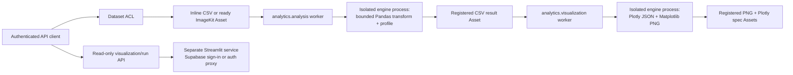

# Data analysis and visualization (Phase 12)

This document is the implementation and operating contract for JT-Code's
tenant-safe analytics path. Django remains the authentication, authorization,
metadata, and artifact-ownership boundary. Pandas, Plotly, Matplotlib, and the
separate Streamlit viewer never receive database credentials or permission to
evaluate user code.

## Architecture



The relational records and provider objects have distinct responsibilities:

| Record | Purpose | Durable output |
| --- | --- | --- |
| `Dataset` | Tenant, owner, source, schema, size, checksum, sharing policy | Inline CSV or a ready input `Asset` |
| `DatasetGrant` | Explicit user-level `view` or `analyze` access | Unique dataset/user policy row |
| `AnalysisRun` | Immutable transform request and durable worker state | Profile, preview, schema, registered CSV `result_asset` |
| `Visualization` | Chart request and durable renderer state | Registered PNG `artifact_asset`, Plotly JSON `spec_asset` (inline copy when small) |

Provider URLs are never stored as durable output. Authorized API serializers
create a short-lived signed delivery URL only while returning a completed,
ready artifact.

## Authorization policy

All queries first resolve the selected tenant from membership and the optional
`X-Organization-ID` header. A supplied UUID never chooses a tenant.

| Actor | View dataset | Run analysis | Manage dataset/grants | View a run/chart |
| --- | --- | --- | --- | --- |
| Dataset owner | Yes | Yes | Yes | Own runs and every run on owned dataset |
| Organization admin | Yes | Yes | Yes | Every tenant run/chart |
| Organization member, shared dataset | Yes | Yes | No | Their own runs/charts |
| User with `view` grant | Yes | No | No | No other user's result |
| User with `analyze` grant | Yes | Yes | No | Their own runs/charts |
| Other tenant | No | No | No | No |

Grant targets must already be members of the dataset's organization. Dataset
owners do not need grants. Dataset mutation and deletion require owner or
organization-admin authority; creating a new dataset still requires the normal
organization editor/admin write role.

## Step-by-step execution

### 1. Register a dataset

`POST /api/v1/analysis/datasets/` accepts exactly one source:

- `inline_data`: UTF-8 CSV up to `ANALYTICS_MAX_INLINE_BYTES`; or
- `asset`: a tenant-owned, ready, integrity-verified ImageKit `Asset` up to
  `ANALYTICS_MAX_DATASET_BYTES`.

Only configured CSV MIME types are accepted. CSV validation rejects empty or
duplicate headers, NUL bytes, invalid UTF-8, parser failures, and configured
row, column, cell, and byte overages. Inline sources are parsed and profiled
synchronously **in the isolated engine process** so invalid input is rejected
with a 400 response. An asset source must be readable by the caller under the
asset visibility policy (owner, admin, or organization-shared), so a dataset
can never wrap another member's private upload. Asset sources are downloaded
only by the isolated worker through a short-lived signed URL and the SSRF-safe
egress layer; downloaded size and SHA-256 must match the registered asset.

### 2. Submit a declarative analysis

`POST /api/v1/analysis/runs/` accepts a dataset id and a JSON `transform`.
There is no Python, SQL, expression, template, shell, pickle, or plugin
execution surface. The allowlisted language supports:

```json
{
  "filters": [
    {"column": "region", "operator": "eq", "value": "East"},
    {"column": "revenue", "operator": "gte", "value": 1000}
  ],
  "group_by": ["region"],
  "aggregate": {"revenue": "sum"},
  "select": ["region", "revenue_sum"],
  "sort": [{"column": "revenue_sum", "direction": "desc"}],
  "limit": 100
}
```

Filter operators are `eq`, `ne`, `gt`, `gte`, `lt`, `lte`, literal
`contains`, and bounded `in`. Aggregates are `count`, `sum`, `mean`, `min`, and
`max`. Every field, collection size, referenced column, numeric operation, and
result limit is validated before or during execution.

### 3. Execute and persist the analysis

The dedicated `analytics.analysis` worker atomically claims a queued run
(`SELECT … FOR UPDATE OF` the run row only), changing it to `running` exactly
once. It reads and verifies the source, refreshes dataset
schema metadata, applies the transform, and enforces the result byte limit.
The exact transformed frame is serialized to CSV and registered through the
central asset service with tenant ownership, SHA-256, ImageKit identity, and
provenance linking the dataset and run.

Only after artifact registration succeeds does the run become `completed`.
It stores a JSON-safe bounded preview, a per-column profile (type, nulls,
distinct count, min/max/mean/std/quartiles for numbers, date range, top values
for categories) and a versioned result schema validated before saving:

```json
{"version": "1", "format": "csv", "columns": ["region", "revenue_sum"],
 "dtypes": {"region": "object", "revenue_sum": "int64"}, "rows": 2,
 "bytes": 42, "checksumSha256": "<sha256 of the result CSV>"}
``` Validation errors are safe and
specific; unexpected provider/library errors are logged server-side while the
API receives a bounded generic failure message.

### 4. Render a visualization

`POST /api/v1/visualizations/` accepts a completed visible analysis run, chart
kind (`bar`, `line`, `area`, `scatter`, `histogram`, `box` or `pie`), an
optional `title` and `color_column`, and columns that exist in the run's
result schema. The
dedicated `analytics.visualization` worker loads the persisted result artifact—not the
original dataset—so the chart always represents the exact transform that the
user reviewed.

Charts are capped by `ANALYTICS_MAX_CHART_POINTS`; numeric axes are validated.
The Plotly specification (JSON) and Matplotlib PNG are both registered as
private ImageKit assets before the visualization becomes `ready`; the spec is
also kept inline when it is at most `ANALYTICS_INLINE_SPEC_BYTES`. The
versioned visualization result schema records kind, formats, byte sizes,
point count and both SHA-256 checksums.

### 5. Recover interrupted work

Celery tasks use late acknowledgement, reject-on-worker-loss, soft and hard
time limits, durable statuses, and transaction-protected claims. Beat runs
`recover_stalled_analytics` every five minutes. Records that remain `running`
beyond `ANALYTICS_STALLED_AFTER_MINUTES` become failed with a terminal
timestamp rather than remaining permanently ambiguous.

### 6. Serve the separate viewer

`streamlit_app/` is an independent service with its own minimal requirements.
It imports neither Django nor any database driver. Users authenticate either
through an authentication proxy that forwards `Authorization` (and optionally
`X-Organization-ID`), or by signing in with Supabase email/password in the app
(`SUPABASE_URL` + `SUPABASE_PUBLISHABLE_KEY`); the session token stays in the
user's Streamlit session. Every JT-Code API call is a `GET` to
`/api/v1/visualizations/` or `/api/v1/analysis/runs/` (pagination followed),
so the server's dataset ACL decides what is shown. Select the organization
with `?org=<uuid>`. In staging/production set `JT_CODE_STREAMLIT_ENV=production`
and HTTPS `JT_CODE_API_BASE_URL`/`SUPABASE_URL`; never give the service
`DATABASE_URL`, the Supabase secret key or provider keys.

```bash
JT_CODE_API_BASE_URL=http://localhost:8000/api/v1 SUPABASE_URL=... \
SUPABASE_PUBLISHABLE_KEY=... streamlit run streamlit_app/app.py
```

## Worker isolation and deployment

All pandas, Plotly and Matplotlib work runs in a separate `python -I
apps/analytics/engine.py` process per operation. The child has an empty
environment (no database, ImageKit, Supabase or model-provider credentials),
a private temporary working directory, and kernel limits applied before it
reads any data: address space `ANALYTICS_SANDBOX_MEMORY_MB`, CPU
`ANALYTICS_SANDBOX_CPU_SECONDS`, 64 MB file writes, 256 open files and no core
dumps. The parent enforces `ANALYTICS_SANDBOX_TIMEOUT_SECONDS` (below the task
soft limit) and only exchanges JSON over stdin/stdout. Run analysis and
rendering on separate queues/processes:

```bash
celery -A config worker -Q analytics.analysis --concurrency=2 --max-tasks-per-child=50
celery -A config worker -Q analytics.visualization --concurrency=1 --max-tasks-per-child=25
celery -A config beat
```

Celery wall-clock limits complement, but do not replace, container resource
limits. The API process should not consume either analytics queue. Network
policy should allow workers to reach PostgreSQL, Redis, and the configured
ImageKit delivery/API hosts only; the Streamlit process needs only the Django
API.

## Failure and deletion semantics

- A failed download, integrity check, transform, upload, or render never marks
  a run/chart successful.
- Retried delivery cannot execute a record twice because only `queued` rows can
  be claimed.
- Deleting a dataset, run or visualization soft-deletes its generated
  result/chart/spec assets for provider lifecycle cleanup, then removes the
  metadata. `POST …/runs/{id}/retry/` and `POST /visualizations/{id}/retry/`
  re-queue failed work; `GET …/runs/{id}/download/` streams the result CSV.
- Dataset deletion does not delete the
  user-supplied source asset.
- Removing an input asset later causes future reads to fail closed; existing
  completed result assets remain independently registered until dataset
  deletion or lifecycle cleanup.

## Production release gate

Phase 12 is releasable only when migrations apply from an empty database,
`makemigrations --check` is clean, Ruff passes, the OpenAPI schema validates
without warnings, and tests prove: cross-tenant invisibility; view-vs-analyze
grant behavior; dataset bounds; asset checksum enforcement; transform
allowlisting; exact-result charting; JSON-safe Plotly persistence; registered
artifact ownership; idempotent claims; stalled-run recovery; queue routing;
the engine child's credential-free environment and memory/time limits; the
asset-visibility check on dataset creation; and the Streamlit
no-database/GET-only boundary.
