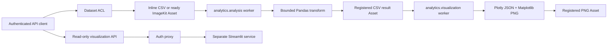

# Data analysis and visualization (Phase 12)

This document is the implementation and operating contract for JT-Code's
tenant-safe analytics path. Django remains the authentication, authorization,
metadata, and artifact-ownership boundary. Pandas, Plotly, Matplotlib, and the
separate Streamlit viewer never receive database credentials or permission to
evaluate user code.

## Architecture



The relational records and provider objects have distinct responsibilities:

| Record | Purpose | Durable output |
| --- | --- | --- |
| `Dataset` | Tenant, owner, source, schema, size, checksum, sharing policy | Inline CSV or a ready input `Asset` |
| `DatasetGrant` | Explicit user-level `view` or `analyze` access | Unique dataset/user policy row |
| `AnalysisRun` | Immutable transform request and durable worker state | Profile, preview, schema, registered CSV `result_asset` |
| `Visualization` | Chart request and durable renderer state | JSON-safe Plotly spec and registered PNG `artifact_asset` |

Provider URLs are never stored as durable output. Authorized API serializers
create a short-lived signed delivery URL only while returning a completed,
ready artifact.

## Authorization policy

All queries first resolve the selected tenant from membership and the optional
`X-Organization-ID` header. A supplied UUID never chooses a tenant.

| Actor | View dataset | Run analysis | Manage dataset/grants | View a run/chart |
| --- | --- | --- | --- | --- |
| Dataset owner | Yes | Yes | Yes | Own runs and every run on owned dataset |
| Organization admin | Yes | Yes | Yes | Every tenant run/chart |
| Organization member, shared dataset | Yes | Yes | No | Their own runs/charts |
| User with `view` grant | Yes | No | No | No other user's result |
| User with `analyze` grant | Yes | Yes | No | Their own runs/charts |
| Other tenant | No | No | No | No |

Grant targets must already be members of the dataset's organization. Dataset
owners do not need grants. Dataset mutation and deletion require owner or
organization-admin authority; creating a new dataset still requires the normal
organization editor/admin write role.

## Step-by-step execution

### 1. Register a dataset

`POST /api/v1/analysis/datasets/` accepts exactly one source:

- `inline_data`: UTF-8 CSV up to `ANALYTICS_MAX_INLINE_BYTES`; or
- `asset`: a tenant-owned, ready, integrity-verified ImageKit `Asset` up to
  `ANALYTICS_MAX_DATASET_BYTES`.

Only configured CSV MIME types are accepted. CSV validation rejects empty or
duplicate headers, NUL bytes, invalid UTF-8, parser failures, and configured
row, column, cell, and byte overages. Inline sources are parsed synchronously
so invalid input is rejected with a 400 response. Asset sources are downloaded
only by the isolated worker through a short-lived signed URL and the SSRF-safe
egress layer; downloaded size and SHA-256 must match the registered asset.

### 2. Submit a declarative analysis

`POST /api/v1/analysis/runs/` accepts a dataset id and a JSON `transform`.
There is no Python, SQL, expression, template, shell, pickle, or plugin
execution surface. The allowlisted language supports:

```json
{
  "filters": [
    {"column": "region", "operator": "eq", "value": "East"},
    {"column": "revenue", "operator": "gte", "value": 1000}
  ],
  "group_by": ["region"],
  "aggregate": {"revenue": "sum"},
  "select": ["region", "revenue_sum"],
  "sort": [{"column": "revenue_sum", "direction": "desc"}],
  "limit": 100
}
```

Filter operators are `eq`, `ne`, `gt`, `gte`, `lt`, `lte`, literal
`contains`, and bounded `in`. Aggregates are `count`, `sum`, `mean`, `min`, and
`max`. Every field, collection size, referenced column, numeric operation, and
result limit is validated before or during execution.

### 3. Execute and persist the analysis

The dedicated `analytics.analysis` worker atomically claims a queued run, changing it to
`running` exactly once. It reads and verifies the source, refreshes dataset
schema metadata, applies the transform, and enforces the result byte limit.
The exact transformed frame is serialized to CSV and registered through the
central asset service with tenant ownership, SHA-256, ImageKit identity, and
provenance linking the dataset and run.

Only after artifact registration succeeds does the run become `completed`.
It stores a JSON-safe bounded preview, row/column schema, dtypes, null counts,
byte count, start time, and completion time. Validation errors are safe and
specific; unexpected provider/library errors are logged server-side while the
API receives a bounded generic failure message.

### 4. Render a visualization

`POST /api/v1/visualizations/` accepts a completed visible analysis run, chart
kind (`bar`, `line`, `scatter`, or `histogram`), and valid columns. The
dedicated `analytics.visualization` worker loads the persisted result artifact—not the
original dataset—so the chart always represents the exact transform that the
user reviewed.

Charts are capped by `ANALYTICS_MAX_CHART_POINTS`; numeric axes are validated.
Plotly output is round-tripped through JSON so NumPy values cannot leak into a
Django `JSONField`. Matplotlib uses the non-interactive `Agg` backend. The PNG
must upload and register successfully before the visualization becomes
`ready`. The Plotly specification also has a serialized byte limit.

### 5. Recover interrupted work

Celery tasks use late acknowledgement, reject-on-worker-loss, soft and hard
time limits, durable statuses, and transaction-protected claims. Beat runs
`recover_stalled_analytics` every five minutes. Records that remain `running`
beyond `ANALYTICS_STALLED_AFTER_MINUTES` become failed with a terminal
timestamp rather than remaining permanently ambiguous.

### 6. Serve the separate viewer

`streamlit_app/` is an independent image with its own minimal requirements and
non-root Dockerfile. It imports neither Django nor any database driver. It
performs only `GET /api/v1/visualizations/` and renders already-authorized API
results. In staging/production:

- put Streamlit behind an authentication proxy;
- forward the user's `Authorization` and `X-Organization-ID` headers;
- set `JT_CODE_STREAMLIT_ENV=production` and an HTTPS
  `JT_CODE_API_BASE_URL`;
- do not give the container `DATABASE_URL`, provider secrets, or a shared
  service token.

`JT_CODE_API_TOKEN` is accepted only when the viewer explicitly runs in local
development mode.

## Worker isolation and deployment

Run analysis and rendering in different containers/processes, each with one
queue and deployment-level CPU/memory/PID limits. Example process commands:

```bash
celery -A config worker -Q analytics.analysis --concurrency=2 --max-tasks-per-child=50
celery -A config worker -Q analytics.visualization --concurrency=1 --max-tasks-per-child=25
celery -A config beat
```

Celery wall-clock limits complement, but do not replace, container resource
limits. The API process should not consume either analytics queue. Network
policy should allow workers to reach PostgreSQL, Redis, and the configured
ImageKit delivery/API hosts only; the Streamlit process needs only the Django
API.

## Failure and deletion semantics

- A failed download, integrity check, transform, upload, or render never marks
  a run/chart successful.
- Retried delivery cannot execute a record twice because only `queued` rows can
  be claimed.
- Deleting a dataset soft-deletes generated result/chart assets for provider
  lifecycle cleanup, then cascades analytics metadata. It does not delete the
  user-supplied source asset.
- Removing an input asset later causes future reads to fail closed; existing
  completed result assets remain independently registered until dataset
  deletion or lifecycle cleanup.

## Production release gate

Phase 12 is releasable only when migrations apply from an empty database,
`makemigrations --check` is clean, Ruff passes, the OpenAPI schema validates
without warnings, and tests prove: cross-tenant invisibility; view-vs-analyze
grant behavior; dataset bounds; asset checksum enforcement; transform
allowlisting; exact-result charting; JSON-safe Plotly persistence; registered
artifact ownership; idempotent claims; stalled-run recovery; queue routing; and
the Streamlit no-database/read-only boundary.
