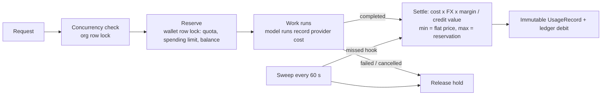

# Usage metering, quotas and rate limits (Phase 13)

`apps.usage` is the single path for charging tenants. Every billable operation
reserves credits **before** it starts and is settled from what it **actually**
used once it finishes. Settlement never charges more than the reservation and
never takes the wallet below zero.

## Lifecycle

| Billable source | Feature | Reserved at | Settled from |
| --- | --- | --- | --- |
| Job (`/jobs/`, `/knowledge/query/`, `/knowledge/rag/query/`, research) | per task type | job creation | model runs with the job's id, or the signed callback's `actual_credits` |
| Chat request | `chat_messages` | message submission | model runs with the chat request id |
| Agent run (API) | `agent_runs` | run creation | the run's recorded cost (runs inside a job bill via the job) |
| Image generate/edit/understand | `image_generations` | before generation | flat price × images produced |
| Document render | `document_renders` | before rendering | flat price |
| File conversion | `file_conversions` | before conversion | flat price (PDF output ×2) |
| Analysis run | `analysis_runs` | run creation/retry | flat price when the worker finishes |
| Knowledge search, embeddings | `search_queries`, `api_calls` | before the call | flat price |

Credits for provider cost: `cost_usd × BILLING_FX_BUFFER × BILLING_MARGIN_MULTIPLIER /
BILLING_CREDIT_VALUE_USD`, rounded up to 6 decimals, never below the feature's
flat price (`USAGE_FLAT_CREDITS`). Reservation ceilings come from
`USAGE_RESERVATION_CREDITS`. When the actual price exceeds the hold, only the
hold is charged and the excess is recorded as `credits_uncollected`.

## Race safety

- **Balance, quota and spending limit:** every reservation for a tenant locks
  that tenant's `CreditWallet` row, so concurrent requests are serialized and
  cannot both observe the last credits or the last quota unit.
- **Concurrent runs:** `enforce_concurrency` locks the `Organization` row inside
  the transaction that creates the run (jobs, chat requests, agent runs,
  analysis runs). Limits come from the plan's `limits`
  (`max_concurrent_jobs`, `max_concurrent_chat_requests`,
  `max_concurrent_agent_runs`, `max_concurrent_analysis_runs`) or the
  `MAX_CONCURRENT_*_PER_TENANT` settings.
- **Idempotency:** one reservation and one usage record per source
  (`source_type`, `source_id`); settling or releasing twice is a no-op.
- `tests/test_phase13_usage.py` proves these with real concurrent threads on
  Supabase PostgreSQL.

## Plan quotas and spending limits

The active plan is the organization's active/trialing/past-due subscription,
or `BILLING_DEFAULT_PLAN`. A `billing.Entitlement` with `limit_type=hard` caps
the feature's units per calendar month (settled + in-flight); `soft` and
`unlimited` do not block. `CreditWallet.monthly_spending_limit` caps credits
charged + held per month. Refusals return `429 quota_exceeded`,
`402 spending_limit_reached`, `402 insufficient_credits` or
`429 concurrency_limit`.

## Immutable ledger

`usage_usagerecord` and `billing_creditledger` have PostgreSQL triggers that
reject `UPDATE` and `DELETE` (migration `usage.0002`). Two exceptions: clearing
a usage record's nullable user/reservation link (user deletion), and
transactions that set `jt_code.ledger_purge` — only organization deletion does,
through a `pre_delete` signal. The credit ledger records balance changes only
(grants, usage debits, refunds); holds live in `UsageReservation` and
`CreditWallet.reserved_balance`.

## Rate limits

`apps.core.ratelimit` counts with `SET NX` + `INCR` on the `rate_limits` Redis
cache (atomic) over a sliding two-window estimate. Every scoped throttle checks
three keys: the client IP (`THROTTLE_IP`), the user (the scope's `THROTTLE_*`
rate) and the tenant (the scope's rate × `THROTTLE_TENANT_MULTIPLIER`, or the
plan's `limits.rate_multiplier`). Views without a scoped throttle get the IP
throttle by default. Denials return `429` with `Retry-After`.

## Background jobs

- `settle_finished_reservations` (every 60 s): settles or releases holds whose
  source finished, so a missed hook can never leak credits; releases holds
  with no resolvable source after their TTL (`USAGE_RESERVATION_TTL_MINUTES`).
- `reconcile_provider_usage` (daily): per organization and provider, compares
  recorded model-run cost, cost recomputed from tokens × current prices, and
  billed cost; flags price drift above `USAGE_RECONCILIATION_DRIFT_RATIO` and
  model runs that no usage record or hold covers.

## Dashboards and APIs

- `GET /api/v1/usage/` — tenant view: `totalCredits`, `byType` (frontend
  buckets), `byFeature`, plan `quotas` with remaining units, `spending`,
  `reservedCredits` and `concurrency`.
- `GET /api/v1/usage/records/?feature=&period=` — the tenant's usage records.
- Staff only (`is_staff`): `GET /api/v1/internal/usage/summary/?from=&to=`
  (revenue, provider cost, gross margin, by feature/day, open holds, drifts),
  `/internal/usage/organizations/`, `/internal/usage/reconciliations/`,
  `/internal/usage/reservations/`. The Django admin shows the same records
  read-only.
